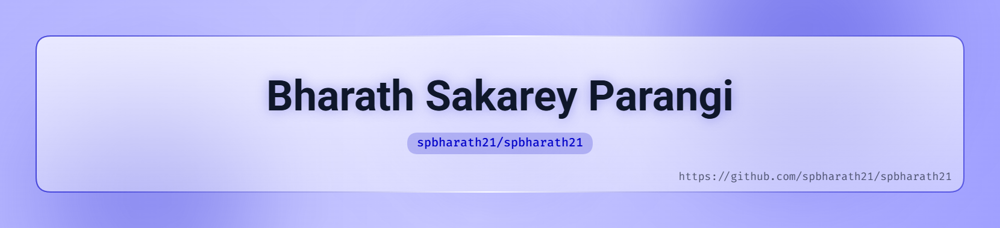

<picture>
  <source media="(prefers-color-scheme: dark)" srcset="./art/header-dark.png">
  <source media="(prefers-color-scheme: light)" srcset="./art/header-light.png">
  
</picture>

  

  

&nbsp;

&nbsp;

  

&nbsp;

&nbsp;

 

---

## `whoami`

 

<table width="92%">
<tr>
<td width="62%" valign="middle">

### Bharath Sakarey Parangi

**Cybersecurity & Software Engineering Student**

B.Tech CSE — Cybersecurity  
**Manipal Institute of Technology** · 2023–2027

I enjoy working at the intersection of **security, software and systems** — understanding how things work, building them from the ground up, testing where they break, and improving them.

My current areas of interest include:

`SIEM` · `SOC` · `Network Security` · `Digital Forensics`

`System Design` · `Cloud Security` · `Application Security` · `AI/ML`

 

> **I don't just want to use technology.  
> I want to understand it, build with it, and make it better.**

</td>

<td width="38%" align="center" valign="middle">

  

</td>
</tr>
</table>

 

---

## ⚙️ Tech Stack

 

<table width="92%">
<tr>

<td width="33%" align="center" valign="top">

### 💻 Languages

 

  

  

`C` · `C++` · `Java`  
`Python` · `JavaScript` · `SQL`

</td>

<td width="33%" align="center" valign="top">

### 🧩 Development

 

  

  

`REST APIs` · `Full Stack` · `OOP`  
`DSA` · `System Design` · `Testing`

</td>

<td width="33%" align="center" valign="top">

### 🛡️ Security & Infra

 

  

`SIEM` · `SOC` · `Splunk`  
`Sysmon` · `Threat Detection`  
`Digital Forensics` · `MITRE ATT&CK`

</td>

</tr>
</table>

 

---

## 🔬 Things I've Built

 

<table width="92%">
<tr>

<td width="50%" valign="top">

### 🧠 GitHub AI Security Auditor

Security-focused static analysis for AI/LLM-powered GitHub repositories.

Built around the **OWASP LLM Top 10**, with multiple scanner modules, automated scoring and test coverage.

**Stack**

`Python` `Static Analysis` `OWASP` `pytest`

 

</td>

<td width="50%" valign="top">

### 📡 Mini-SIEM

A lightweight SIEM for real-time log ingestion, rule-based detection and security investigation.

Designed to handle multiple concurrent log sources while identifying attacks such as brute-force attempts and anomalous network activity.

**Stack**

`Python` `SIEM` `MITRE ATT&CK` `Forensics`

 

</td>

</tr>

<tr>

<td width="50%" valign="top">

### 💳 NFC Payment Simulator

A full-stack simulation of a contactless payment workflow combining application development, database systems and machine learning.

**Stack**

`Python` `Flask` `React` `MongoDB` `ML`

 

</td>

<td width="50%" valign="top">

### 🖥️ SOC Home Lab

A hands-on SOC environment combining endpoint telemetry, SIEM monitoring, attack simulation and incident investigation.

Built using **Splunk, Sysmon, Windows and Ubuntu**, with simulated attacks mapped to MITRE ATT&CK.

**Stack**

`Splunk` `Sysmon` `Windows` `Ubuntu`

 

</td>

</tr>
</table>

 

---

## 🔐 Security Interests

 

<table width="86%">
<tr>

<td align="center">

**01**

### Detection

`SIEM` · `SOC` · `Threat Detection`  
`Log Analysis` · `Incident Response`

</td>

<td align="center">

**02**

### Systems

`Network Security` · `System Design`  
`Digital Forensics` · `Distributed Systems`

</td>

<td align="center">

**03**

### Secure Development

`Application Security` · `Cloud Security`  
`Secure SDLC` · `Security Automation`

</td>

<td align="center">

**04**

### Intelligence

`AI/ML` · `Phishing Detection`  
`Security Analytics` · `Automation`

</td>

</tr>
</table>

 

---

## 📊 GitHub Pulse

 

<table width="92%">
<tr>

<td width="50%" align="center">

</td>

<td width="50%" align="center">

</td>

</tr>
</table>

 

  

 

---

## 🏆 GitHub Trophies

 

 

---

## 🐍 Contribution Trail

 

<i>Consistency compounds.</i>

  

<picture>
  <source
    media="(prefers-color-scheme: dark)"
    srcset="./output/github-contribution-grid-snake-dark.svg"
  />
  <source
    media="(prefers-color-scheme: light)"
    srcset="./output/github-contribution-grid-snake.svg"
  />
  
</picture>

<!--
===============================================================
GitHub Action — Contribution Snake
===============================================================

Create:

.github/workflows/snake.yml

with:

name: Generate Contribution Snake

on:
  schedule:
    - cron: "0 0 * * *"
  workflow_dispatch:

permissions:
  contents: write

jobs:
  generate:
    runs-on: ubuntu-latest

    steps:
      - name: Generate snake
        uses: Platane/snk@v3
        with:
          github_user_name: ${{ github.repository_owner }}
          outputs: |
            output/github-contribution-grid-snake.svg
            output/github-contribution-grid-snake-dark.svg?palette=github-dark

      - name: Commit generated files
        uses: EndBug/add-and-commit@v9
        with:
          default_author: github_actions
          message: "chore: update contribution snake"
          add: "output"
-->

 

---

## 🧭 A Little More About Me

 

<table width="82%">
<tr>

<td align="center" width="25%">

### 💡

**Innovator**

</td>

<td align="center" width="25%">

### 🔄

**Adaptable**

</td>

<td align="center" width="25%">

### 🎯

**Driven**

</td>

<td align="center" width="25%">

### 🔎

**Curious**

</td>

</tr>
</table>

 

  <i>
    I like taking an idea, figuring out what makes it work, 
    and then pushing it until I understand where its limits are.
  </i>

 

---

## 🌐 Connect

 

&nbsp;

&nbsp;

&nbsp;

  

 

---

  <b>Build. Break. Learn. Repeat.</b>

  
    Cybersecurity · Software Engineering · Systems · AI/ML
  

 

<picture>
  <source
    media="(prefers-color-scheme: dark)"
    srcset="https://capsule-render.vercel.app/api?type=waving&height=140&section=footer&color=0:0B1120,45:1D4ED8,100:7C3AED&animation=fadeIn"
  />
  <source
    media="(prefers-color-scheme: light)"
    srcset="https://capsule-render.vercel.app/api?type=waving&height=140&section=footer&color=0:DBEAFE,45:60A5FA,100:8B5CF6&animation=fadeIn"
  />
  
</picture>

